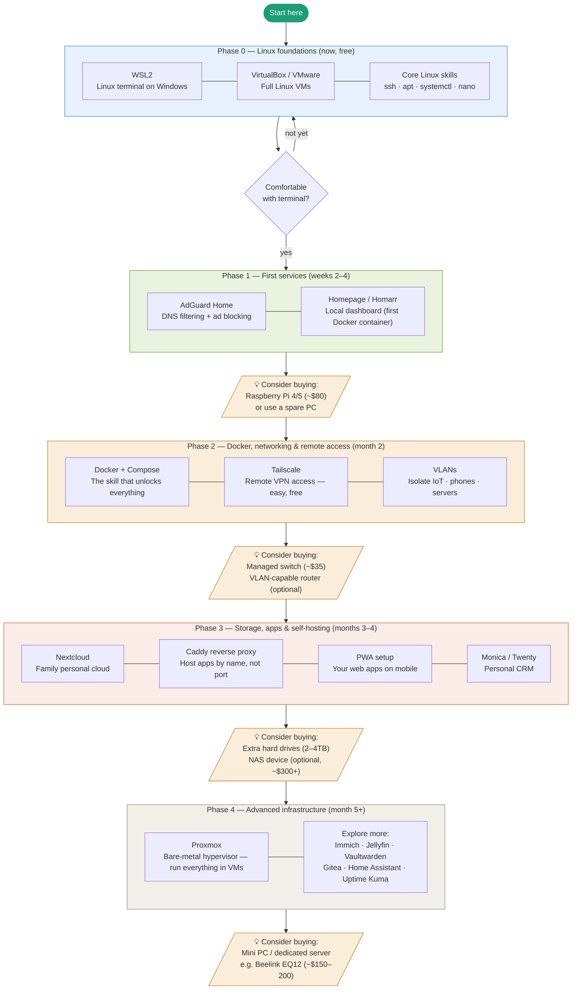

```mermaid
flowchart TD
    START([Start here]) --> P0

    subgraph P0["Phase 0 — Linux foundations (now, free)"]
        direction LR
        WSL2["WSL2\nLinux terminal on Windows"]
        VBOX["VirtualBox / VMware\nFull Linux VMs"]
        LINUX["Core Linux skills\nssh · apt · systemctl · nano"]
        WSL2 --- VBOX --- LINUX
    end

    P0 --> READY{"Comfortable\nwith terminal?"}
    READY -->|not yet| P0
    READY -->|yes| P1

    subgraph P1["Phase 1 — First services (weeks 2–4)"]
        direction LR
        DNS["AdGuard Home\nDNS filtering + ad blocking"]
        DASH["Homepage / Homarr\nLocal dashboard (first Docker container)"]
        DNS --- DASH
    end

    P1 --> BUY1[/"💡 Consider buying:\nRaspberry Pi 4/5 (~$80)\nor use a spare PC"/]
    BUY1 --> P2

    subgraph P2["Phase 2 — Docker, networking & remote access (month 2)"]
        direction LR
        DOCKER["Docker + Compose\nThe skill that unlocks everything"]
        TAIL["Tailscale\nRemote VPN access — easy, free"]
        VLAN["VLANs\nIsolate IoT · phones · servers"]
        DOCKER --- TAIL --- VLAN
    end

    P2 --> BUY2[/"💡 Consider buying:\nManaged switch (~$35)\nVLAN-capable router (optional)"/]
    BUY2 --> P3

    subgraph P3["Phase 3 — Storage, apps & self-hosting (months 3–4)"]
        direction LR
        NC["Nextcloud\nFamily personal cloud"]
        CADDY["Caddy reverse proxy\nHost apps by name, not port"]
        PWA["PWA setup\nYour web apps on mobile"]
        CRM["Monica / Twenty\nPersonal CRM"]
        NC --- CADDY --- PWA --- CRM
    end

    P3 --> BUY3[/"💡 Consider buying:\nExtra hard drives (2–4TB)\nNAS device (optional, ~$300+)"/]
    BUY3 --> P4

    subgraph P4["Phase 4 — Advanced infrastructure (month 5+)"]
        direction LR
        PROX["Proxmox\nBare-metal hypervisor — run everything in VMs"]
        EXTRAS["Explore more:\nImmich · Jellyfin · Vaultwarden\nGitea · Home Assistant · Uptime Kuma"]
        PROX --- EXTRAS
    end

    P4 --> BUY4[/"💡 Consider buying:\nMini PC / dedicated server\ne.g. Beelink EQ12 (~$150–200)"/]

    style START fill:#1D9E75,color:#fff,stroke:none
    style P0 fill:#E6F1FB,stroke:#378ADD,stroke-width:1px
    style P1 fill:#EAF3DE,stroke:#639922,stroke-width:1px
    style P2 fill:#FAEEDA,stroke:#BA7517,stroke-width:1px
    style P3 fill:#FAECE7,stroke:#D85A30,stroke-width:1px
    style P4 fill:#F1EFE8,stroke:#888780,stroke-width:1px
    style READY fill:#EEEDFE,stroke:#7F77DD,stroke-width:1px
    style BUY1 fill:#FAEEDA,stroke:#BA7517,stroke-width:1px
    style BUY2 fill:#FAEEDA,stroke:#BA7517,stroke-width:1px
    style BUY3 fill:#FAEEDA,stroke:#BA7517,stroke-width:1px
    style BUY4 fill:#FAEEDA,stroke:#BA7517,stroke-width:1px
```
